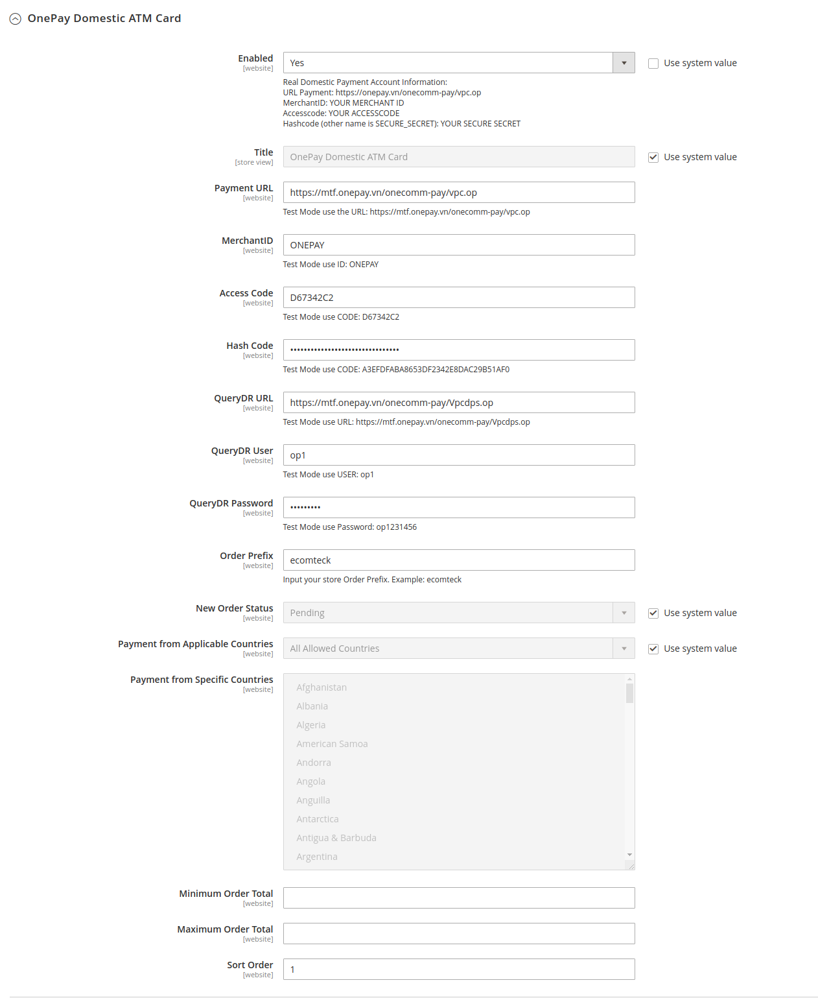
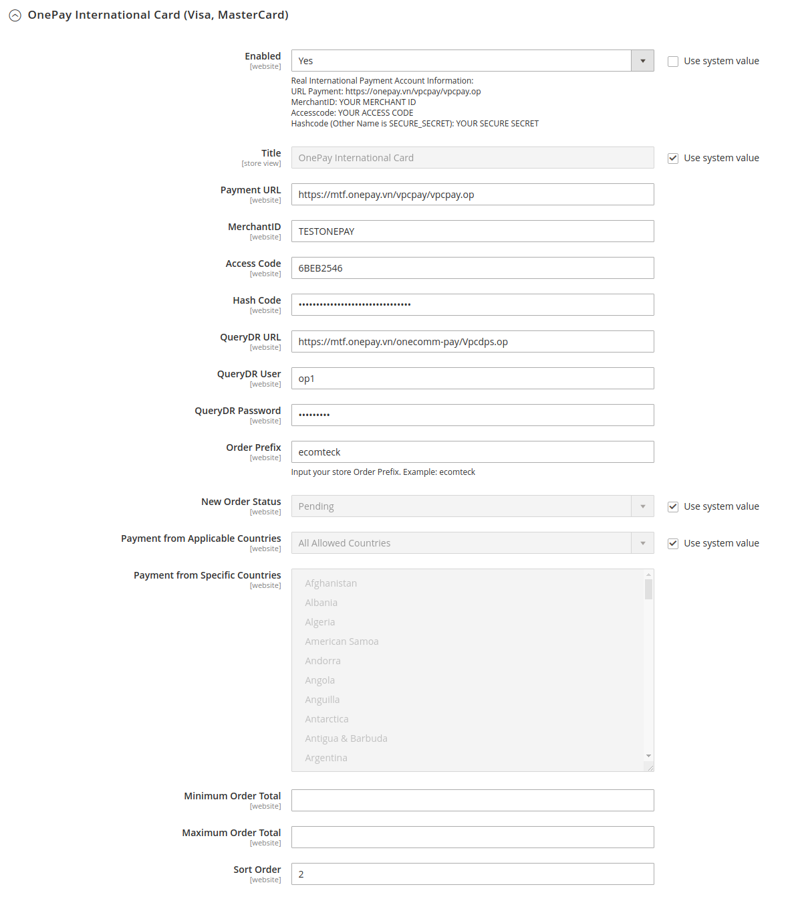

# OnePay Payment Gateway for Magento 2
In this module, I integrated two payments gateway of OnePay, that is the Domestic ATM Card and International Card.
- [OnePay Payment Homepage](https://onepay.vn)
- [Ecomteck Extension homepage](https://ecomteck.com)
- [Download Module File](https://ecomteck.com/downloads/onepay-payment-gateway-for-magento-2/)

## How to install this extension?
 + Under the root of your website, please run the command lines bellowing:
    - **composer require ecomteck/module-core**
    - **composer require ecomteck/module-onepay-payment-gateway**
    - **php bin/magento module:enable Ecomteck_Core**
    - **php bin/magento module:enable Ecomteck_OnePay**
    - **php bin/magento setup:upgrade**
    - **php bin/magento setup:static-content:deploy -f**
    - **php bin/magento setup:di:compile**
    - **php bin/magento indexer:reindex**
    - **php bin/magento cache:flush**

## How to see the results?

### - On the Backend:
- Go to the Admin Panel of the Magento Store and navigate to the Ecomteck → OnePay Payment Gateway → Configuration
    + Domestic ATM Card Settings:
    + International Card Settings: 
- The configuration information:
    + International card: https://mtf.onepay.vn/developer/?page=modul_quocte
    + Domestic card: https://mtf.onepay.vn/developer/?page=modul_noidia

### - On the Storefront:
- Add a product to shopping cart.
- Go the the checkout page.

## The screenshot of this extension

### - On the Storefront:

#### *The OnePay payment gateway - Domestic ATM card*

#### *The OnePay payment gateway - International card*

### - On the Backend Settings:

#### *The OnePay payment gateway settings - Domestic ATM card*

#### *The OnePay payment gateway settings - International card*

### - Document to integration:
 - DOMESTIC PAYMENT GATEWAY: https://mtf.onepay.vn/developer/resource/documents/docx/introduction_merchant_integration_local.pdf
 - INTERNATIONAL PAYMENT GATEWAY: https://mtf.onepay.vn/developer/resource/documents/docx/introduction_merchant_integration.pdf